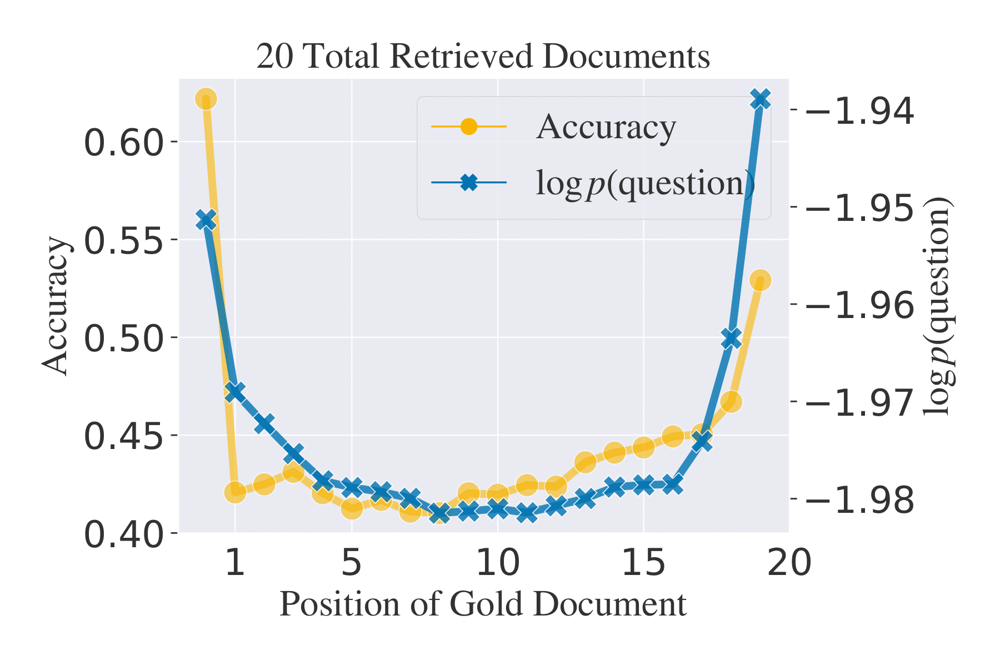

# Likelihood as a performance gauge for retrieval-augmented generation

This repository contains the code for the paper "Likelihood as a performance gauge for retrieval-augmented generation".

<!--  -->

## Table of Contents

- [Install the package](#install-the-package)


## Install the package

1. Clone the repository
```bash
git clone https://github.com/lyutyuh/poptimizer.git
```

2. Create a conda environment
```bash
conda env create -f environment.yml
conda activate poptimizer
```

3. Install the package
```bash
# MAX_JOBS is the number of jobs to speed up the installation for flash attention
MAX_JOBS=4 pip install -e .
```
 